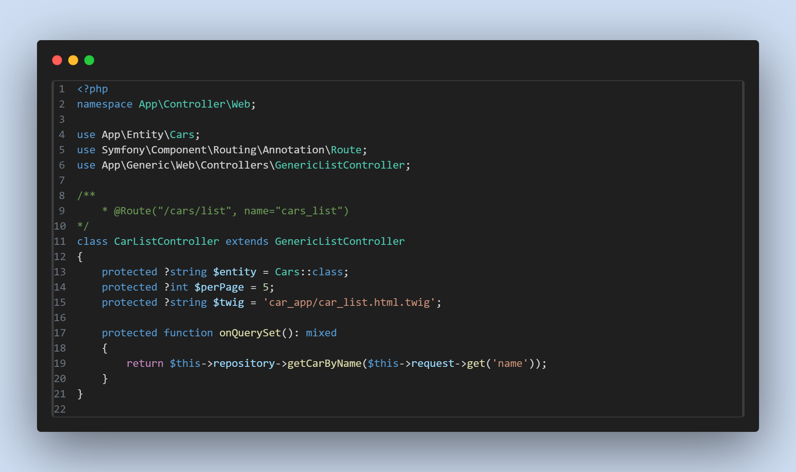

# Projekt: Generyczne Widoki

## Cel

Celem tego projektu jest zwiększenie powtarzalności i produktywności procesu tworzenia aplikacji poprzez wdrożenie generycznych widoków inspirowanych rozwiązaniem dostępnym w Django. Projekt ma na celu zapewnienie spójnego wyglądu i sposobu działania różnych aplikacji, automatyzację powtarzalnych zadań oraz ułatwienie programistom tworzenia interfejsów użytkownika, pozwalając im skupić się na logice biznesowej aplikacji.

## Kontekst

Obecny proces tworzenia aplikacji często jest czasochłonny i wymaga dużej ilości ręcznego kodowania. Brak spójności w interfejsach użytkownika sprawia, że użytkownicy mają trudności z korzystaniem z różnych aplikacji.

## Rozwiązanie

Stworzenie zestawu generycznych widoków, które:

* Zapewnią spójny wygląd i sposób działania różnych aplikacji.
* Zautomatyzują powtarzalne zadania.
* Ułatwią programistom tworzenie interfejsów użytkownika, pozwalając im skupić się na logice biznesowej aplikacji.

## Korzyści

* Zwiększenie powtarzalności i produktywności procesu tworzenia aplikacji.
* Ułatwienie użytkowania i konserwacji aplikacji.
* Spójny i intuicyjny interfejs użytkownika dla wszystkich aplikacji.

## Inspiracja

Projekt czerpie inspirację z funkcjonalności generycznych widoków dostępnych w Django.

---

## Użycie

Projekt jest uzupełnieniem mechanizmów dostępnych w Symfony, oferując dodatkowe funkcje i narzędzia wymagania:

* Symfony framework
* PHP wersja X.X lub wyższa
* Composer

## Przykłady użycia

W przypaku widkoów genrycznych  @Route przypisuje się nad klasą a nie nad metodą.

**Klasa `GenericListController` służy do wyświetlania listy obiektów.**

**Użycie:**

**W przypadku API:**

1. Wystarczy odziedziczyć klasę.
2. W atrybucie `entity` podać encję w formie `NazwaEncji::class`.

**W przypadku wersji web:**

1. Odziedziczyć klasę.
2. W atrybucie `template` podać ścieżkę do szablonu Twig.

Klasa `GenericListController` zapewnia podstawowe funkcje do wyświetlania listy obiektów, takie jak paginacja, filtrowanie i sortowanie.

Aby użyć paginacji, wystarczy w atrybucie `perPage` podać ilość obiektów na stronie.

Domyślnie nie jest ustawiona żadna metoda filtrowania listy. Jeśli nie wykona się żadnych dodatkowych działań, zostanie wykonana metoda `findAll()`, która wyświetli wszystkie obiekty.

Aby to zmienić, należy nadpisać metodę `onQuerySet()`. W tej metodzie można podać, jak metoda zostanie wykonana w Repository.

**Przykład:**

W każdym widoku webowym można nadpisać metodę `onSetAttribute`. Jest ona wykorzystywana do przekazywania wartości do widoku. Nie ma potrzeby podawania podstawowych informacji, takich jak lista czy obiekt. Metoda służy tylko do dodatkowych informacji, np. tytułu strony i innych wartości.

**Klasa `GenericCreateController` jest dostępna zarówno dla API, jak i dla strony web.** Służy do tworzenia nowych obiektów w bazie danych**.** Sposób jej użycia jest podobny do `GenericListController`, ale w przypadku strony web należy podać w atrybucie `form` klasę formularza w formie `Formularz::class`. Klasa posiada metody `onAfterValid` i `onValid`, które służą do określania, co się wydarzy przed lub po walidacji.

Sposób użycia `GenericUpdateController` jest taki sam jak `GenericCreateController`, z tą różnicą, że ten kontroler przeznaczony jest do aktualizacji danych istniejącego rekordu.

**Obie klasy są przystosowane do API.** Aby wykonać walidację w API, należy do atrybutu `DTO` przypisać obiekt DTO i w nim określić sposób walidacji.

Licencja

Ten projekt jest objęty licencją [MIT](). Możesz go dowolnie wykorzystywać, modyfikować i rozpowszechniać zgodnie z warunkami tej licencji.
